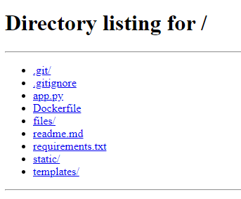
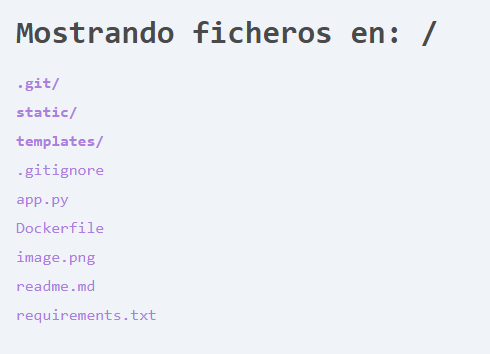

# Simple Python fileserver

Una alternativa elegante y quizas inecesaria a usar:

```
python3 -m http.server 
```

*Disclaimer:*
*Practicamente el 99% del codigo escrito usando la ayuda de Gemini.*

**Antes**  


**Despues**  


### Usando Flask

En la carpeta con **app.py**
```
flask run
```

### Usando Docker
Construir imagen:
```bash
docker build -t simplefiler .
```

Lanzar contenedor mapeando la carpeta del host a la carpeta del contenedor:
```bash
docker run -d -p 8000:8000 -v /home/david/fileserver:/app/files -e FILES_DIR=/app/files --name simplefiler-container simplefiler
```
